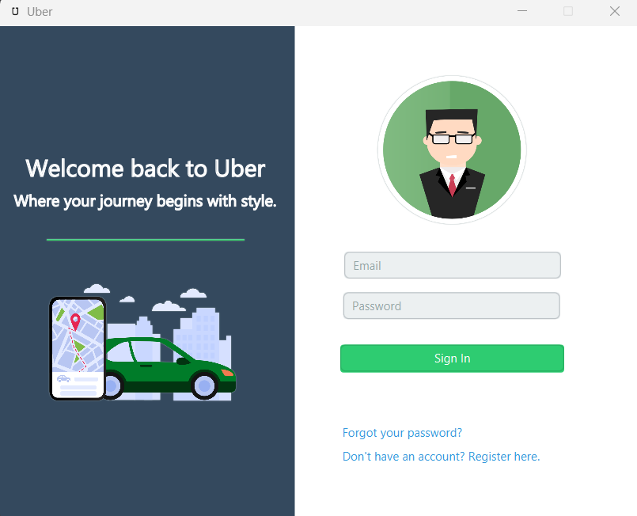
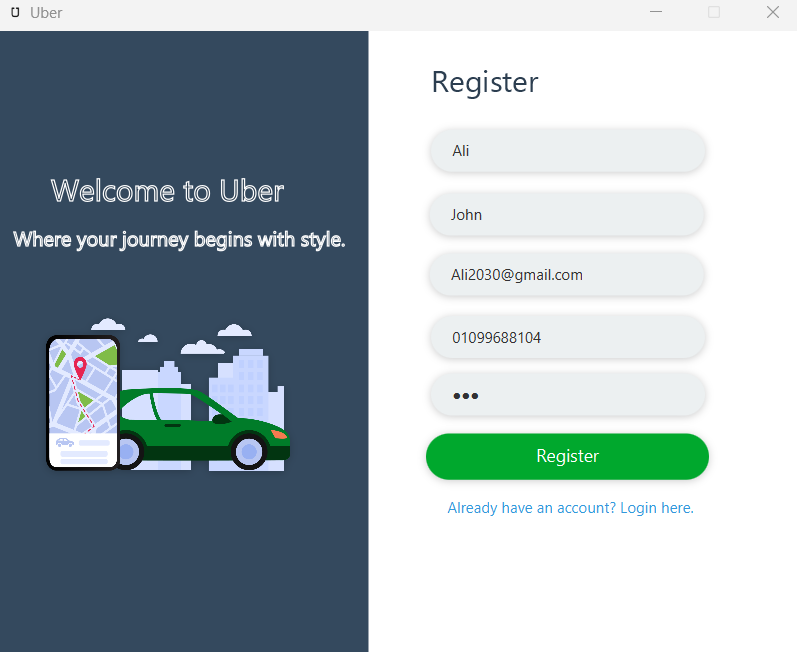
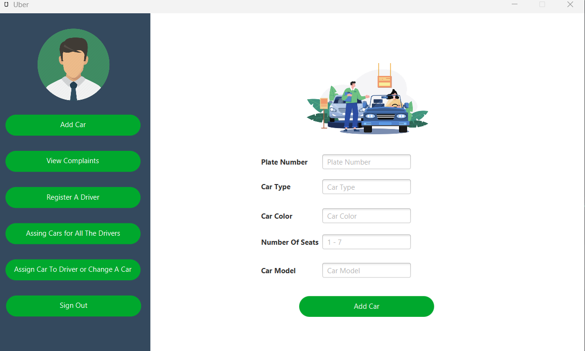
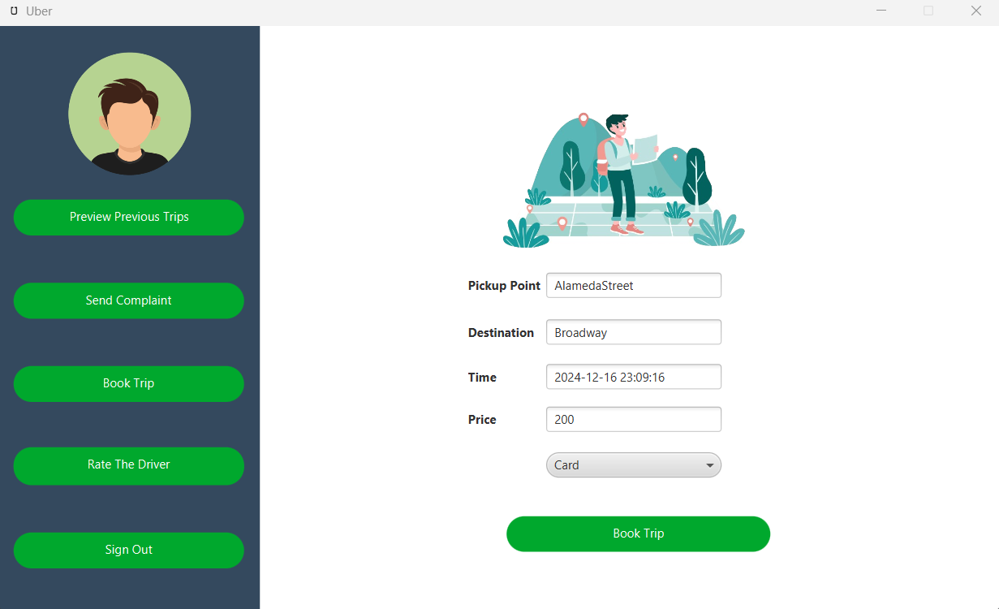
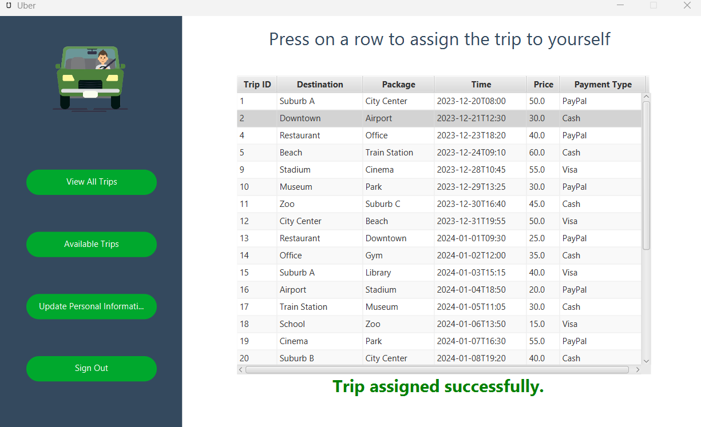
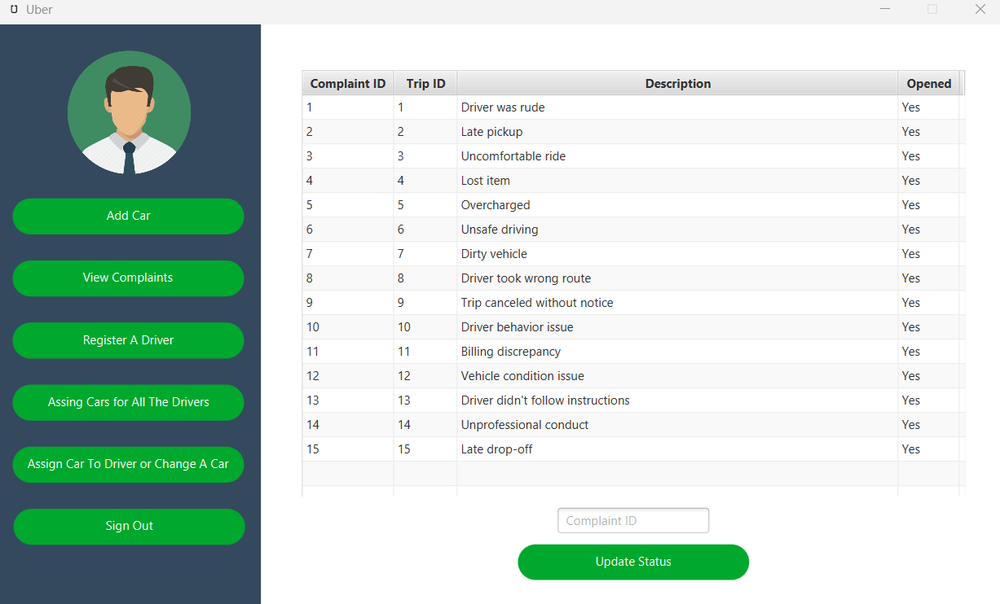
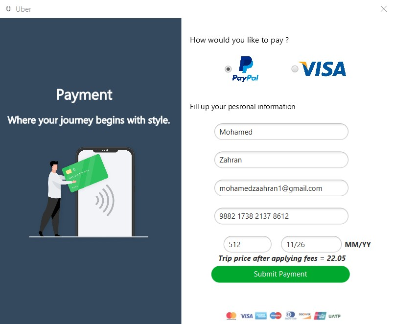

# Mini Uber Project

## Table of Contents
- [Description](#project-description)  
- [Structure and Modules](#project-structure--modules)  
- [Technologies Used](#technologies-used)  
- [Project Walkthrough](#project-walkthrough) 

 

## Project Description
The Mini Uber project focuses on implementing the core functionalities of a ride-sharing application while also implementing some of the design patterns learned in the `Design Patterns` course. It includes features such as user registration, ride request creation, driver availability, ride acceptance, and ride completion.

## Project Structure & modules
The project is organized into several modules, including:
- `Customer Management`: In this module the customer have the ability to login/register to the system. Obviously can also book a trip by entering pick up ,destination points and the requested time.Also, can view his/her previous trip and complain about any trip. Also customer can rate any trip's driver.

- `Driver Management`: In this module driver has the ability to search & accept any of the available trips requested also can view his/her previous trips.

- `Employee Management`: In this module employee has the ability to register new drivers and add new cars to the system. Also can assign a new car or even change with another driver's car. Employee also have the ability to view all customer's complaints.

## Technologies Used

- `Java`
- `MySql`
- `CSS`
- `Java FXML`

## Project Walkthrough

[Full System WalkThrough Video](https://drive.google.com/file/d/1oZnsU3TCUq4WgkhGB5kYL9dI8l2gNwbd/view?usp=drive_link)
 

#### Login Page

 
 
 

#### Registration Page

 
 
 

#### Employee Page

 
 
 

#### Customer Page

 
 
 

#### Driver selecting from available rides page

 
 
 

#### Employee checking complaints of any trip Page

 
 
 

#### Paying with credit page

